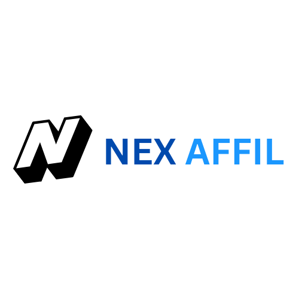

# Nexaffil - Affiliate Marketing Platform 



Nexaffil is a platform designed to connect businesses and affiliates, allowing them to collaborate and grow together. Affiliates can promote business products and earn revenue through a commission-based model, while businesses can leverage affiliates to expand their reach and increase conversions.

## Getting Started

Follow these steps to get started with the project:

### Prerequisites

Ensure that you have the following installed on your machine:  
**Node.js**: [Download and install Node.js](https://nodejs.org/).  
**npm** (comes with Node.js): [npm documentation](https://www.npmjs.com/).

### Installation

Clone the repository:

```bash
git clone https://github.com/yourusername/nexaffil.git
Navigate to the project directory:

bash
Copy code
cd nexaffil
Install dependencies:

bash
Copy code
npm install
Available Scripts
In the project directory, you can run:

npm start
Runs the app in development mode.
Open http://localhost:3000 to view it in your browser.
The page will reload when you make changes. You may also see any lint errors in the console.

npm test
Launches the test runner in interactive watch mode.
See the section about running tests for more information.

npm run build
Builds the app for production to the build folder.
It correctly bundles React in production mode and optimizes the build for the best performance.
The build is minified and the filenames include the hashes.
Your app is ready to be deployed!

npm run eject
Note: This is a one-way operation. Once you eject, you can't go back!
If you need full control over the build configuration, you can eject at any time. This will remove the single build dependency from your project and copy the configuration files (webpack, Babel, ESLint, etc.) into your project for full customization.

Learn More
You can learn more about React and project setup from the following resources:

React Documentation
React API Reference

Deployment
For deploying your Nexaffil app, follow these guides:

Deploying to GitHub Pages
Deploying to Firebase

Troubleshooting
If you face issues related to the npm run build or any dependencies, please refer to the official documentation for troubleshooting:

Build Fails to Minify
